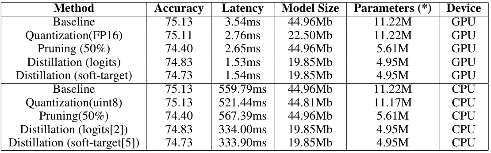

# Efficient-CV

A repo to evaluate different low-latency inference methods using PyTorch
  * data: Cifar-100
  * techniques:
    * Quantization
    * Pruning
    * Knowledge Distillation

## 1. Train baseline model

*  Install dependency

```
pip install -r requirements.txt
```

*  Train baseline model (resnet18)
```
python efficient_cv/train.py --do_train --do_eval --n_gpu 1 --optim sgd --num_epochs 100 --batch_size 128 --scheduler multistep --lr 0.1 --model_name resnet18
```

## 2. Train distillation student model

* Direct logits training (resnet10) ([paper](https://arxiv.org/abs/1312.6184)):
```
python efficient_cv/train.py --do_train --n_gpu 1 --optim sgd --num_epochs 200 --batch_size 128 --scheduler multistep --lr 0.1 --model_name resnet18 --student_model_name resnet10 --test_model_path <trained-model-path-from-step-2> --distill_method logits --distill_weight 0.1
```

* Soft target training (resnet10) ([paper](https://arxiv.org/abs/1503.02531)):
```
python efficient_cv/train.py --do_train --n_gpu 1 --optim sgd --num_epochs 200 --batch_size 128 --scheduler multistep --lr 0.1 --model_name resnet18 --student_model_name resnet10 --test_model_path <trained-model-path-from-step-2> --distill_method soft --distill_weight 0.1 --temperature 4
```

## 3. Evalution

*  Evaluate model with low-latency techniques
```
python efficient_cv/train.py --do_eval --test_model_path <trained-model-path-from-step-2> --n_gpu 1 --benchmarks baseline,quantization,fp16,pruning,distillation --model_name resnet18 --student_model_name resnet10 --student_test_model_path <trained-model-path-from-step-3>

```

## Results

<p align="center">
    <br>
    
    <br>
<p>

---

Distillation method refers to https://github.com/AberHu/Knowledge-Distillation-Zoo

Cifar100 baseline method refers to https://github.com/weiaicunzai/pytorch-cifar100